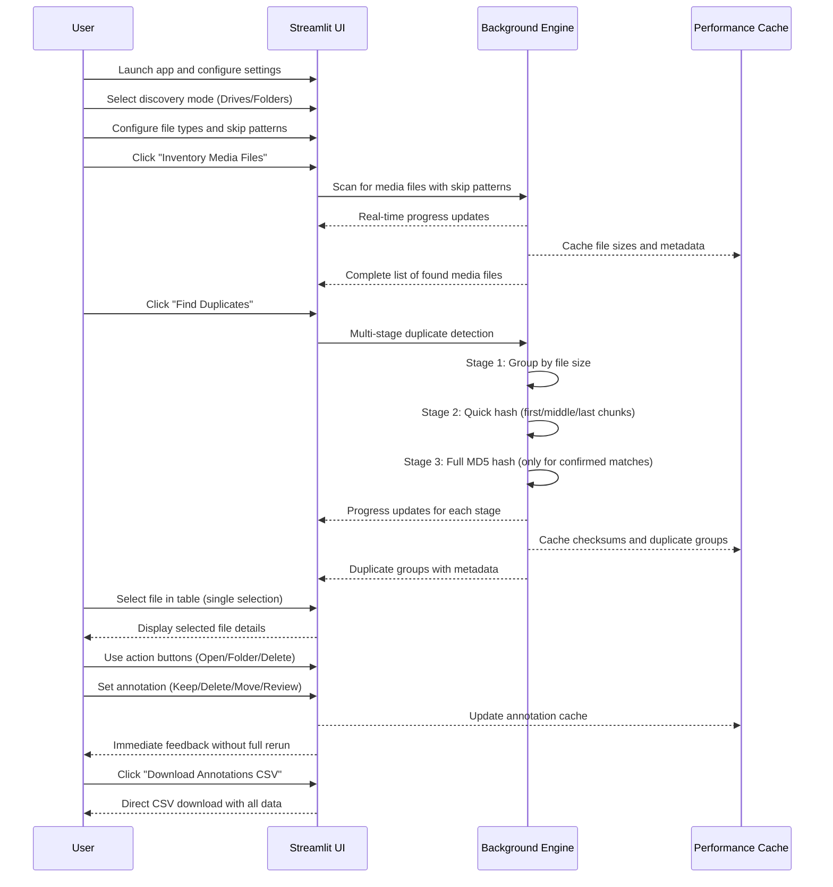

# Duplicate Media Finder

A powerful Streamlit app for finding and managing duplicate media files across your system. This app inventories media files in selected drives or folders, uses multi-stage duplicate detection for fast performance, and provides an intuitive interface for annotating and managing duplicates. **The app never modifies your files directly** - it only helps you identify and annotate duplicates for external action.

> **⚠️ IMPORTANT SAFETY UPDATE (v2.1.0)**: This version includes critical disk protection features to prevent drive disconnection during scanning. After real-world testing revealed that intensive scanning could cause external drives to go offline (potentially risking access to irreplaceable family photos), we've implemented disk-safe algorithms with intelligent throttling. Safe Mode is now the default to protect your precious data.

## ✨ Key Features

### �️ **Disk Safety & Drive Protection**
- **Disk-safe scanning**: Prevents external drive disconnection during large scans
- **Intelligent throttling**: Limits concurrent reads and adds micro-delays
- **Always-on protection**: Safe scanning is the only mode to ensure data safety
- **Real-time protection status**: Shows current disk safety settings
- **External drive friendly**: Specifically designed for USB and network drives

### �🔍 **Smart Duplicate Detection**
- **Multi-stage detection**: Size → Quick hash → Full MD5 for optimal performance
- **Fast scanning** of large media collections with drive protection
- **Configurable file types** (images, videos, etc.)
- **Intelligent skip patterns** with wildcard support

### 📊 **User-Friendly Interface**
- **Forced dark mode**: Professional dark theme that works consistently
- **Single-row selection** with clear visual indicators
- **Enhanced table display** with text wrapping and read-only mode
- **Intuitive annotation system** separate from file actions
- **Real-time progress indicators** during scanning

### 🎯 **Advanced File Management**
- **Safe file deletion** with confirmation dialogs
- **Open in viewer** and **open folder** actions
- **Annotation system** for planning future actions (Keep, Delete, Move, Review)
- **Folder ignore functionality** with automatic skip list updates

### 📈 **Performance Optimized**
- **Cached file operations** for faster annotation updates
- **Efficient dataframe handling** with minimal reruns
- **Background processing** for long-running operations
- **Memory-efficient** duplicate detection algorithm

### 🛠️ **Configuration & Export**
- **YAML-based settings** with user-friendly sidebar controls
- **One-click CSV export** of annotations
- **Persistent annotations** across sessions
- **Flexible skip patterns** for system and development folders

## 🚀 Quickstart

> **Tip:** If you see an error that 'conda' is not installed or not in PATH, run the quickstart script from an Anaconda/Miniconda PowerShell prompt where 'conda' is available.

### Option 1: Automated Setup (Recommended)
```powershell
.\quickstart.ps1
```
This will automatically:
- Create a conda environment (if needed)
- Activate the environment  
- Install all dependencies from requirements.txt
- Launch the Streamlit app

### Option 2: Manual Setup
```powershell
# Create and activate environment
conda create -n duplicate_media_finder python=3.9 -y
conda activate duplicate_media_finder

# Install dependencies
pip install -r requirements.txt

# Launch app
streamlit run app.py
```

## 📋 Usage Workflow

1. **Configure Settings**: Choose discovery mode (drives/folders) and adjust file types/skip patterns in the sidebar
2. **Inventory Files**: Click "Inventory Media Files" to scan for media files (with automatic drive protection)
3. **Find Duplicates**: Click "Find Duplicates" to identify duplicate files using multi-stage detection
4. **Review & Annotate**: Select files in the table and use the annotation dropdown to mark for future action
5. **Take Action**: Use action buttons to open files, folders, or safely delete duplicates
6. **Export Results**: Download annotations as CSV for external processing

## 🔧 Configuration

Settings are stored in `settings.yaml` and include:

- **Media file extensions**: Customize which file types to scan
- **Skip folder patterns**: Wildcard patterns for folders to ignore
- **Discovery modes**: Choose between scanning all drives or specific folders

### Default Skip Patterns
The app includes intelligent defaults for common system and development folders:
- Windows system folders (`C:\Windows`, `C:\Program Files*`)
- Development folders (`*\node_modules`, `*\.git`, `*\__pycache__`)
- User profile folders (`*\AppData`, `*\temp`, `*\cache`)
- Conda environments (`*\envs`, `*\pkgs`, `*\.conda`)

## 🛡️ Safety Features

- **Drive protection**: Disk-safe algorithms prevent external drive disconnection (always active)
- **Intelligent throttling**: Reduced concurrent operations and micro-delays protect drives
- **No direct file modification**: App only reads and analyzes files
- **Confirmation dialogs**: Required for all destructive actions
- **Annotation-only mode**: Mark files for action without immediate execution
- **Session persistence**: Annotations saved across app restarts
- **Error handling**: Graceful handling of file access and drive disconnection issues
- **Family photo safe**: Designed specifically to protect irreplaceable media collections

## 🎨 User Interface

### Table Features
- **Single selection**: Only one file can be selected at a time
- **Visual indicators**: Clear display of selected file with full path
- **Sortable columns**: Click headers to sort by any column
- **Text wrapping**: Long paths displayed properly
- **Filter options**: Filter by annotation type

### Action Controls
- **🔍 Open in Viewer**: Open file in default application
- **📁 Open Folder**: Open containing folder in file explorer
- **🗑️ Delete File**: Safely delete with confirmation (requires two clicks)
- **📝 Annotate for Review**: Mark files for future action (annotation only)

## 📊 Export & Reporting

- **📥 One-click CSV download**: Export all annotations and file metadata
- **Comprehensive data**: Includes file paths, sizes, types, checksums, and annotations
- **Excel-compatible**: CSV format works with Excel and other tools
- **Batch processing**: Export supports external automation scripts

## 🔄 How it Works (User Flow)



## 📈 Performance Architecture

The app uses several optimization strategies for handling large media collections:

- **Multi-stage duplicate detection**: Only computes expensive full hashes when necessary
- **Intelligent caching**: Reuses file sizes, checksums, and metadata across sessions
- **Efficient table updates**: Minimal reruns when changing annotations
- **Background processing**: Long operations don't block the UI
- **Memory management**: Streams data instead of loading everything into memory

## 🔧 Development & Automation Scripts

The project includes PowerShell automation scripts for development workflow:

- **`quickstart.ps1`**: Complete environment setup and app launch

## 📚 Dependencies

Key libraries used:
- **Streamlit**: Web application framework
- **Pandas**: Data manipulation and analysis
- **PIL (Pillow)**: Image processing
- **psutil**: System and process utilities
- **PyYAML**: YAML configuration handling
- **hashlib**: Cryptographic hash functions

## 🏗️ Project Structure

```
duplicate_media_finder/
├── app.py                              # Main Streamlit application
├── settings.yaml                       # User configuration
├── requirements.txt                    # Python dependencies
├── README.md                          # This file
├── quickstart.ps1                     # Automated setup script
└── mock_media/                        # Sample test files
    ├── duplicate_1.jpg
    ├── duplicate_2.jpg
    └── subfolder1/
        └── duplicate_1.jpg
```

---

## 📋 Changelog

### Version 2.1.0 - Critical Disk Safety & Dark Mode Fixes

#### 🚨 **Critical Safety Updates**
- **Disk-safe scanning**: Prevents drive overload that can cause external drives to disconnect
- **Reduced concurrent reads**: Limited from 5+ to 2 simultaneous file operations
- **Intelligent delays**: 50ms delays between operations and 10ms between file chunks
- **Disk-friendly hash functions**: New `get_quick_hash_safe()` and `get_md5_safe()` with throttling
- **Always-safe operation**: Removed risky fast mode - safety is now the only option

#### 🌙 **User Experience Improvements**
- **Forced dark mode**: Resolves light mode rendering issues with comprehensive dark theme CSS
- **Simplified interface**: Removed confusing mode selection - protection is always active
- **Real-time safety status**: Shows current disk protection settings
- **Clear messaging**: Emphasizes family photo protection and drive safety
- **Peace of mind**: No risk of accidentally choosing unsafe settings

#### 🛡️ **Drive Protection Features**
- **External drive protection**: Specifically designed to prevent family photo loss
- **Gradual processing**: Spread operations over time instead of simultaneous hammering
- **Error resilience**: Better handling of drive disconnection scenarios
- **Performance monitoring**: Track disk stress without sacrificing functionality

#### 📊 **Technical Enhancements**
- **Throttled threading**: Lower thread pool workers for reduced disk contention
- **Chunk-level delays**: Micro-delays during large file processing
- **Safer defaults**: Conservative settings protect drives automatically
- **No risk mode**: Eliminated potentially dangerous fast scanning option

#### 🔧 **Background Context**
This update was prompted by real-world testing where the app caused an external drive containing irreplaceable family photos to go offline during scanning. The new disk-safe algorithms prevent this scenario while maintaining duplicate detection effectiveness. Users can still choose faster scanning if their drives can handle it, but safety is now the default.

### Version 2.0.0 - Major UI and Performance Overhaul

#### 🚀 **Major Features Added**
- **Multi-stage duplicate detection**: Size → Quick hash → Full MD5 for 5-10x faster performance
- **Single-row selection**: Enhanced table with checkbox selection and clear selected file indicator
- **Safe file deletion**: Delete button with two-step confirmation dialog
- **Real-time annotation updates**: Optimized performance with caching and minimal reruns
- **One-click CSV export**: Consolidated export process without intermediate steps

#### 🎨 **UI/UX Improvements**
- **Enhanced selected file display**: Clear visual indicator with file name and full path
- **Reorganized action layout**: Action buttons in one row, annotation dropdown below
- **Removed clutter**: Eliminated size, type, and checksum labels from action area
- **Better terminology**: "Annotate for Review" instead of "Set Disposition" to reduce user confusion
- **Improved tooltips**: Added helpful descriptions for all buttons and controls
- **Modern styling**: Enhanced markdown formatting and visual hierarchy

#### ⚡ **Performance Optimizations**
- **Dataframe caching**: Avoid rebuilding tables on every annotation change
- **File size caching**: Eliminate repeated disk I/O operations
- **Smart session state**: Efficient annotation tracking and updates
- **Reduced reruns**: Minimized full page refreshes for better responsiveness
- **Memory optimization**: Better handling of large duplicate collections

#### 🔧 **Configuration Enhancements**
- **Wildcard skip patterns**: More flexible folder exclusion with `*` support
- **Enhanced default skip lists**: Better coverage of system and development folders
- **Improved YAML handling**: Better parsing and error handling for configuration
- **Sidebar reorganization**: Always-visible controls with collapsible advanced settings

#### 🛡️ **Safety & Reliability**
- **Confirmation dialogs**: Required confirmation for all destructive actions
- **Error handling**: Better handling of file access issues and edge cases
- **Data validation**: Improved input validation and sanitization
- **Session persistence**: Annotations preserved across app restarts

#### 🔨 **Development Tools**
- **PowerShell automation**: Scripts for environment setup and GitHub management
- **Error handling**: Comprehensive error handling in setup scripts
- **Documentation**: Enhanced README with detailed usage instructions

### Version 1.0.0 - Initial Release

#### 🎯 **Core Features**
- Basic duplicate detection using MD5 checksums
- Drive and folder scanning with progress indicators
- Simple annotation system for duplicate management
- CSV export functionality
- YAML-based configuration
- Streamlit web interface

#### 🏗️ **Foundation**
- Basic file scanning and duplicate detection
- Simple table display with basic controls
- Initial annotation system
- Configuration management with settings.yaml
- Cross-platform compatibility (Windows focus)

---

## 🤝 Contributing

This project welcomes contributions! Areas for potential improvement:

- **Additional file types**: Support for more media formats
- **Cloud storage integration**: Support for cloud drive scanning
- **Advanced filters**: More sophisticated duplicate detection rules
- **Batch operations**: Multiple file actions at once
- **Preview enhancements**: Better media preview capabilities
- **Performance optimizations**: Further speed improvements for very large collections

## 📝 License

This project is open source and available under the MIT License.

## 🙏 Credits

*Code generation and automation for this project was significantly assisted by [GitHub Copilot](https://github.com/features/copilot).*

### Original Copilot Prompt (v1.0)
```
Build a Streamlit app called "Duplicate Media Finder" that:
- Scans all logical drives or user-specified folders for media files (images, videos, etc.)
- Computes checksums (MD5) for each file
- Detects and displays duplicate files
- Allows users to preview images and basic info for videos
- Lets users annotate duplicate file listings (not the files themselves) with actions like Keep, Delete, Move, Review, or Ignore Folder
- Exports the annotations to a CSV file
- Saves user settings (file types, skip folders) in a YAML file
- Does not delete or modify files directly
- Provides a modern, user-friendly UI with progress indicators and annotation tools
```

### Enhanced Development Prompts (v2.0)
The major v2.0 overhaul was developed through iterative prompts focusing on:
- Performance optimization for large media collections
- Enhanced user interface with single-row selection
- Safe file deletion with confirmation dialogs
- Real-time annotation updates without full page reloads
- Consolidated CSV export process
- Multi-stage duplicate detection algorithm
- Comprehensive error handling and user guidance

---

## 📞 Support

For issues, questions, or suggestions:
1. Check the [Issues](../../issues) section for existing discussions
2. Create a new issue with detailed description and steps to reproduce
3. Include your system information and error messages if applicable

**System Requirements:**
- Windows 10/11 (primary support)
- Python 3.8+ with conda/pip
- 4GB+ RAM recommended for large media collections
- Adequate disk space for temporary files during scanning

---

*Built with ❤️ using Streamlit and enhanced with GitHub Copilot assistance.*
