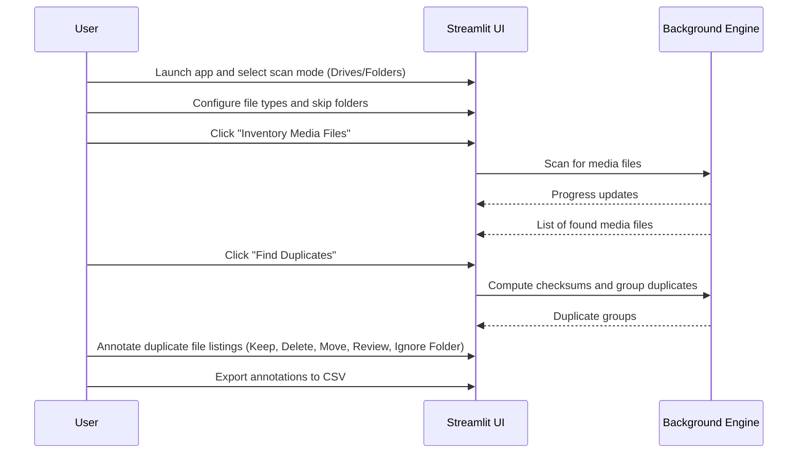

# Duplicate Media Finder

This Streamlit app inventories all media files in selected drives or folders, computes checksums, and helps you reconcile duplicates. This app does not modify or delete your files. Instead, it allows you to annotate duplicate file listings (not the files themselves) for external review or action. All annotations are saved separately and can be exported for further processing.

## Features
- Scan all logical drives or user-specified folders for media files (images, videos, etc.)
- Compute MD5 checksums for each file
- Detect and display duplicate files
- Preview images and basic info for videos
- Annotate duplicate file listings for external review or action (e.g., mark as Keep, Delete, Move, Review, Ignore Folder)
- Export annotations to CSV for further processing

## Quickstart

1. Use the provided PowerShell script to set up your environment and launch the app:
   ```powershell
   .\quickstart.ps1
   ```
   This will:
   - Create a conda environment (if needed)
   - Activate the environment
   - Install requirements from requirements.txt
   - Launch the Streamlit app

2. Alternatively, set up manually:
   ```sh
   pip install -r requirements.txt
   streamlit run app.py
   ```

## Notes
- Scanning large drives or folders may take time.
- Settings (file types, skip folders) are saved in `settings.yaml`.

## How it Works (User Flow)



## Example UI Actions

- Inventory media files from selected drives or folders
- Find and review duplicate groups
- Annotate each duplicate file listing for later action
- Export your annotations for external review or scripting

---

*Code generation and automation for this project was assisted by [GitHub Copilot](https://github.com/features/copilot).*
